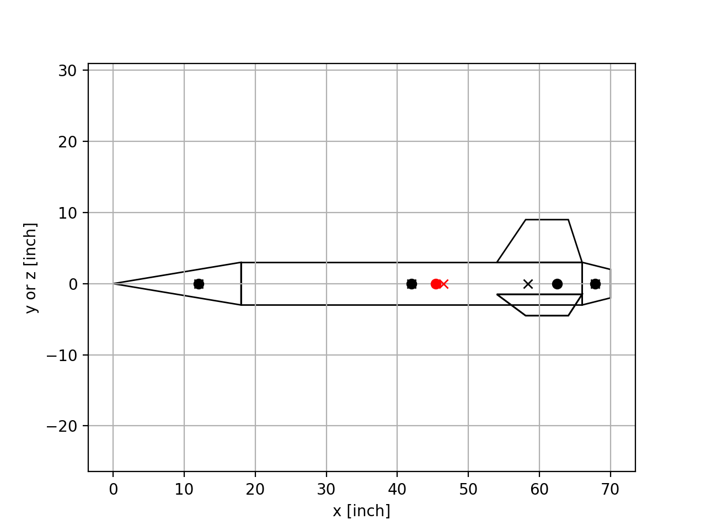

=====
Usage
=====

To use rocketPy in a project::

    import rocketPy

Simple usage of rocketPy is seen in the simple example file:

.. literalinclude:: ../examples/simple/simple.py
  :language: python
  :linenos:

which should provide an output of

  Rocket schematic. x mark center of pressures, o mark center of masses. The red ones correspond to the full rocket.

.. literalinclude:: ../examples/simple/output.txt
  :language: text
